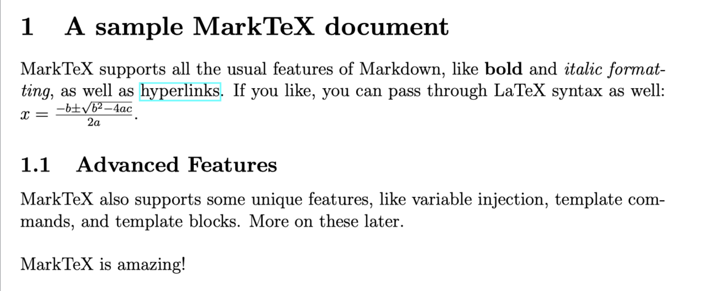

# MarkTeX

MarkTeX is a document preparation and generation system. It aims to
combine the simplicity of Markdown with the expressive power of Haskell
and the beautiful typography of LaTeX. MarkTeX's basic features are accessible to those unfamiliar
with Haskell while still allowing advanced users to add their own logic
through sub-templates and Haskell modules.

Here's a short example:
```markdown
# A sample MarkTeX document

MarkTeX supports all the usual features of Markdown, like **bold** and
*italic formatting*, as well as [hyperlinks](https://google.com). If
you like, you can pass through LaTeX syntax as well:
$x=\frac{-b\pm\sqrt{b^2-4ac}}{2a}$.

## Advanced Features

MarkTeX also supports some unique features, like variable injection,
template commands, and template blocks. More on these later.


~x~ 

```

And its corresponding output:



This repository contains the libraries for the template language MarkTeX.TemplateLang and for MarkTeX itself.
It also contains the executable MarkTeX and a test suite for different steps in the process of this executable.

# Usage

All the commands specified below must be run in the top-level directory of the MarkTeX repository.

You can build the project by running the following:
`stack build`

To run the program for an input Markdown/MarkTeX file *input.md*, an output file *output.pdf*:
`stack run -- input.md output.pdf`

To run it with data from a file *data.json*:
`stack run -- input.md output.pdf data.json`

Running the test suite can be done with:
`stack test`
